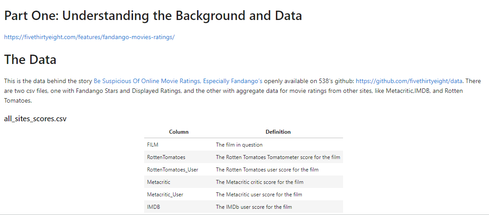
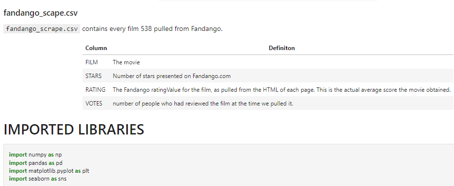
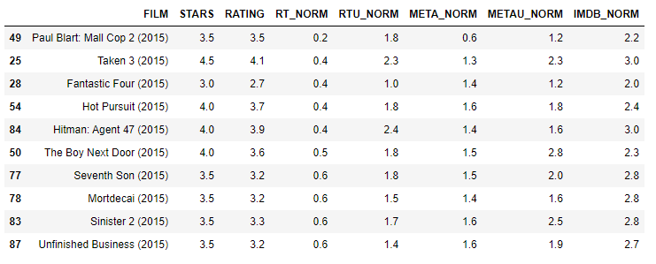
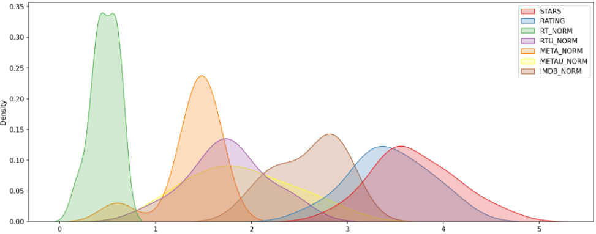

# Capstone Project

Capstone Project i did from "2022 Python for Machine Learning & Data Science Masterclass" UDEMY course.

Tools:

Seaborn\
Mathplotlib\
Numpy\
Python3

## Normalized scores across all platforms for the top 10 worst movies.

## Visualizing the distribution of ratings across all sites for the top 10 worst movies.

